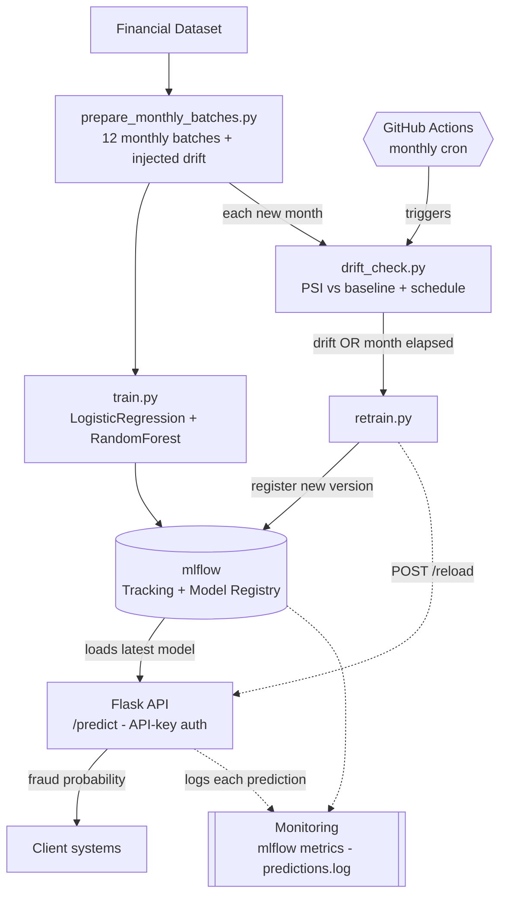

# Fraud Detection MLOps Pipeline

**The scenario:** a government agency receives thousands of support applications a
month. Fraud is rising, which blocks genuine applicants. This system scores each
application for fraud probability, serves that score over a REST API, and —
because the underlying patterns shift over time — **retrains and redeploys itself**
on a schedule _and_ whenever the incoming data drifts. The emphasis is the MLOps
loop, not model sophistication.

## Architecture



## Why the pieces are what they are

| Concern             | Choice                                         | Reason                                                                                              |
| ------------------- | ---------------------------------------------- | --------------------------------------------------------------------------------------------------- |
| Data                | Kaggle **PaySim** synthetic transactions       | Human-readable features (type, amount, balances) that can be explained; brief allows synthetic data |
| Model               | scikit-learn LogisticRegression + RandomForest | Comparing a baseline vs. the deployed model is a defensible choice                                  |
| Serving             | Flask, hand-written `/predict`                 | Plain code, no framework — not `mlflow models serve`                                                |
| Tracking + registry | mlflow (SQLite backend)                        | The Registry needs a database backend; answers the storage/versioning/monitoring questions          |
| Automation          | GitHub Actions (scheduled + drift-triggered)   | Simplest MLOps platform to run and demo, no infra                                                   |
| Access control      | API key header check                           | "Only authorized eyes"; kept simple on purpose                                                      |
| Storage             | flat CSV                                       | Enough for sample data; human-readable                                                              |

## Setup

Requires **Python 3.13**.

```bash
# Create and activate a virtual environment (use your Python 3.13 binary)
python3.13 -m venv .venv          # or e.g. /opt/homebrew/bin/python3.13
source .venv/bin/activate         # Windows: .venv\Scripts\activate

pip install -r requirements.txt

# Set the API key the service will require
cp .env.example .env              # then edit .env and set FRAUD_API_KEY
```

### Get the data — two options

**(Kaggle).** Download _"Synthetic Financial Datasets
For Fraud Detection"_ (`ealaxi/paysim1`), rename the CSV to `paysim.csv`, and put
it in `data/raw/`.

## Running the pipeline

```bash
# 1. Build the 12 simulated monthly batches (with injected drift)
python data/prepare_monthly_batches.py

# 2. Train + register the baseline model (on month 1)
python model/train.py

# 3. Check any month for data drift (PSI vs the month-1 baseline)
python model/drift_check.py --batch data/batches/month_05.csv

# 4. Serve the model (loads the latest registered version)
python service/app.py            # http://127.0.0.1:8000

# 5. Run the full year: retrain on schedule OR drift, and reload the live API
python automation/retrain.py
```

### Calling the API

```bash
# Health (no key needed) — shows which model version is serving
curl http://127.0.0.1:8000/health

# Predict (needs the API key) — returns a fraud probability
curl -X POST http://127.0.0.1:8000/predict \
  -H "X-API-Key: <your key from .env>" \
  -H "Content-Type: application/json" \
  -d '{"type":"TRANSFER","amount":500000,"oldbalanceOrg":500000,"newbalanceOrig":0,"oldbalanceDest":0,"newbalanceDest":0}'
# -> {"fraud_probability": 0.97, "is_fraud": true, "model_version": 1, ...}
```

Requests without a valid `X-API-Key` header are rejected with `401`.

## Monitoring

- **Training:** every run is logged to mlflow. Browse it with:
  ```bash
  mlflow ui --backend-store-uri sqlite:///mlflow.db   # http://127.0.0.1:5000
  ```
- **Serving:** every prediction is appended as a JSON line to
  `logs/predictions.log` (timestamp, model version, probability), so the live
  model's behaviour can be watched over time.

## Automated retraining

`.github/workflows/retrain.yml` runs the whole loop on a **monthly cron** (and can
be triggered by hand from the **Actions** tab → _Run workflow_). It generates its
own synthetic data, so it runs end to end on GitHub with nothing to download.

The model retrains when **either** trigger fires first: a fixed schedule, or a
**PSI drift** check crossing its threshold. This is demonstrated by simulating a
year of monthly data with drift injected into a few months — the pipeline catches
the drift and retrains off-schedule, and the running API reloads the new version.

## Repo structure

```
data/prepare_monthly_batches.py   split into 12 monthly batches + drift
model/train.py                    train, track, and register the model
model/drift_check.py              PSI drift detection vs the baseline
service/app.py, service/auth.py   Flask API + API-key auth
automation/retrain.py             schedule/drift retraining loop (reloads the API)
automation/make_sample_data.py    synthetic data generator (no download needed)
.github/workflows/retrain.yml     scheduled GitHub Action
diagrams/architecture.mmd         the diagram above (editable source)
```

## License / attribution

Course project. PaySim dataset by E. A. Lopez-Rojas et al., via Kaggle
(`ealaxi/paysim1`).
